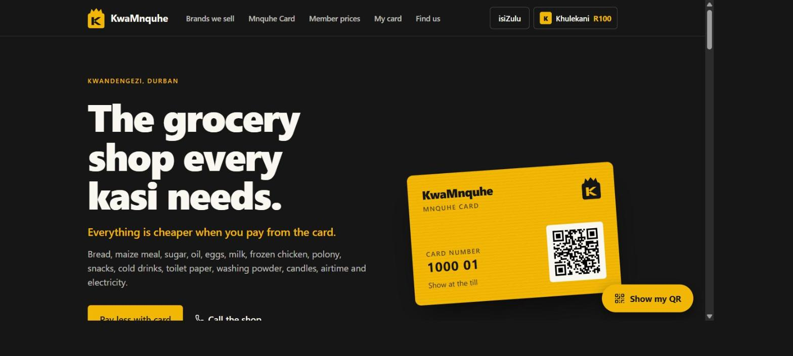
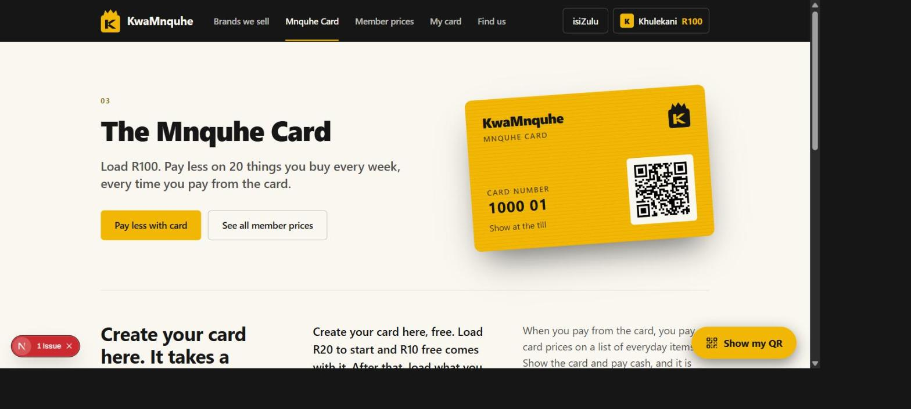
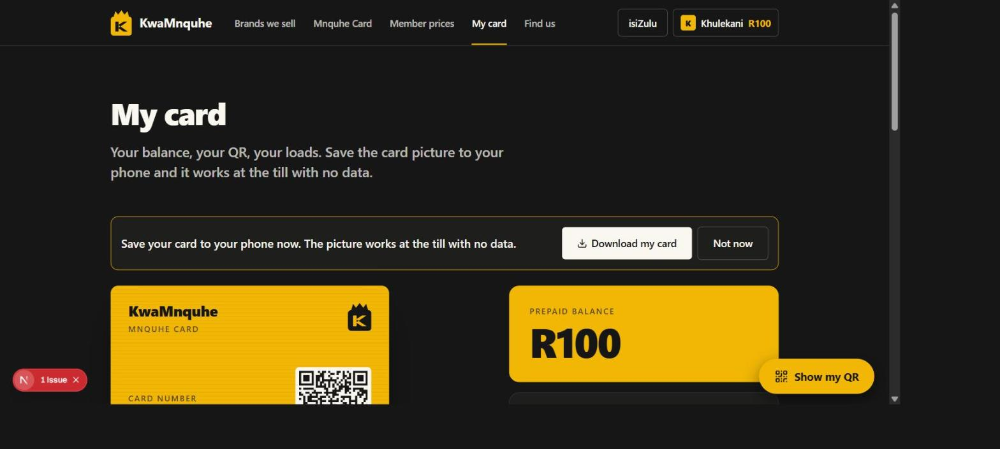
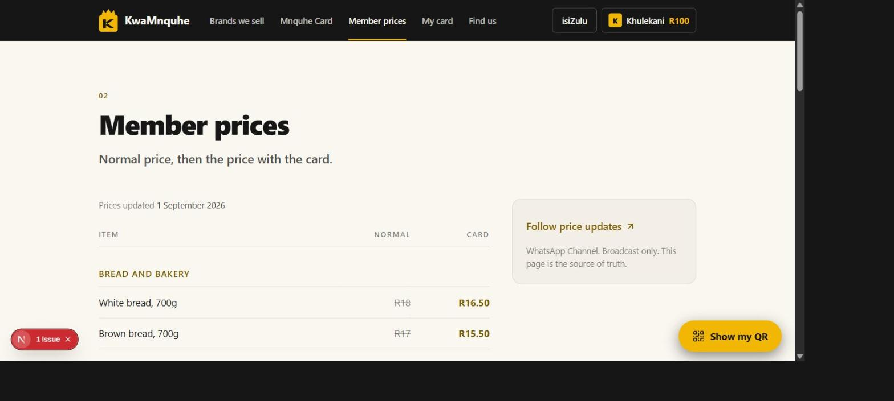
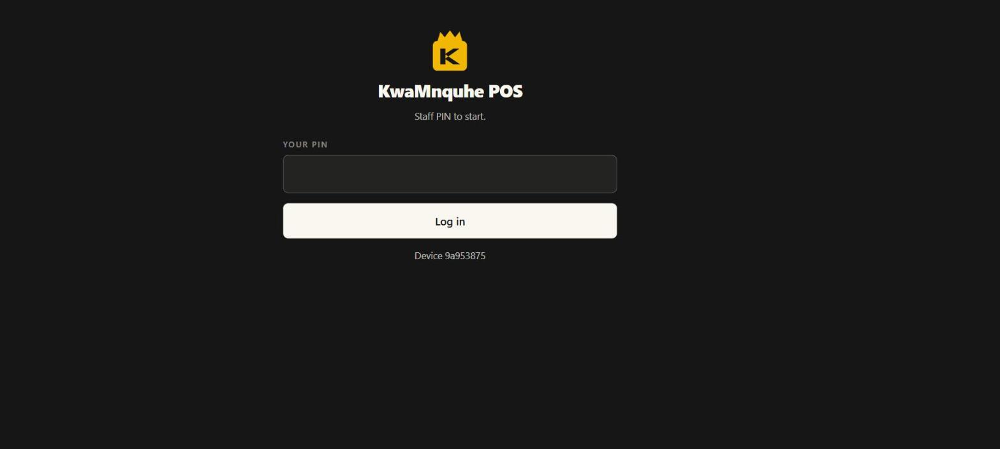

# KwaMnquhe

The public site for a grocery shop in Durban that started from a single shipping container, with
the long-term goal of supplying other shops.

<table>
<tr>
<td width="50%"> The Mnquhe Card</td>
<td width="50%"> My card — balance, QR, loads</td>
</tr>
<tr>
<td width="50%"> Member prices — normal price, then the card price</td>
<td width="50%"> The till, installed as a PWA on the shop tablet</td>
</tr>
</table>

The till, stock and wallet live in a separate repo (`kwamquhe-pos`). This one is the storefront:
prices, brands, where to find us, and the Mnquhe Card.

## The one idea

The site has a single call to action — **pay less with card** — and every page either supports it
or gets cut. Prices are the whole reason someone visits a shop's website, so the price list is the
product, not a sub-page.

Prices and suppliers are held as JSON, one source of truth, rather than being typed into pages.
Changing a price means editing `public/data/prices.json` and uploading it. No rebuild, no
developer.

## Stack — the site

Next.js 16 with a static export, React 19, Tailwind CSS 4, and Base UI / shadcn components.
`@zxing/browser` handles QR scanning, `qrcode` generates the card sign-up code, and `pdf-lib`
produces printable price lists.

## The till and the wallet

Point of sale, stock and the Mnquhe Card prepaid wallet for a grocery shop that started in a
shipping container, built so the same code later runs many shops under one owner.

### Why it's built this way

The till has to work when the network doesn't. Load-shedding, a dropped LTE signal, a tablet in a
container with thick walls — none of that can stop a sale. So the device holds the product master,
the tiers, the customers and an outbox in IndexedDB, and syncs batches when it can. Everything
downstream of that decision follows from it.

**Supabase over a Node server.** For one shop with one owner it gives three things immediately that
a hand-rolled server would take weeks to match: real auth for the owner's login, row-level security
keyed on `shop_id` so the many-shops future is a policy change rather than a rewrite, and hosted
Postgres with backups. The parts that need server code — sync, the payment gateway callback, the
SMS digest, the public card API — run as edge functions. It's all plain Postgres underneath, so it
moves if it ever needs to.

**Preact, not React.** The till has to feel instant on a mid-range Android tablet. The whole
runtime is a few kilobytes.

**One shared file for the card format.** `shared/card.ts` holds the `KM:` QR format and its
checksum, and is byte-for-byte the same file the public site uses. A SQL function
`card_checksum()` produces the same result, so the till, the site and the database agree on what a
valid card code is. One scanner routes between product barcodes and customer QR codes by looking
for the `KM:` prefix.

### What the data model enforces on its own

These are constraints in the database, not conventions in the app:

- Every business table carries `shop_id`, and row-level security policies key on it.
- All money is integer cents. All timestamps are `timestamptz` in UTC.
- Stock and the wallet are append-only ledgers. `product.stock_qty` and `customer.balance_cents`
  are caches maintained by triggers, so two devices can't overwrite each other's arithmetic.
- A wallet balance can never go below zero — the trigger refuses the row.
- A wallet adjustment without a reason is refused.
- A payment gateway reference can only be credited once.
- Every product must resolve to a price source (an override, a tier, or a parent with one) or the
  insert fails.
- One active card per customer. A card holds no balance, only an id, so a lost card is voided and
  replaced without touching the money.
- Master data deletes are soft. Ledger rows can't be deleted at all.

Break-bulk products — loose eggs out of a tray, cigarettes out of a carton — carry no barcode of
their own. Selling one writes a movement against the parent for `parent_units × qty`, and the
child's own stock stays at zero.

### Stack — the till

| | |
| --- | --- |
| Front end | Preact + Vite, TypeScript, installed as a PWA |
| Local storage | Dexie / IndexedDB — product master, tiers, customers, outbox |
| Backend | Supabase: Postgres, Auth, row-level security, Storage, Edge Functions |
| Scanning | Camera-based barcode and QR, phone-to-till pairing |
| Payments | Card machine, cash, Mnquhe Card, Yoco; gateway top-ups via callback |
| Hosting | Vercel (root directory `app`), Supabase for the backend |

## Status

In build, in use.

---

Source is private — this repo is the write-up. [Shaun Madondo](https://github.com/TheC0deJunkie) · Durban, KwaZulu-Natal.
